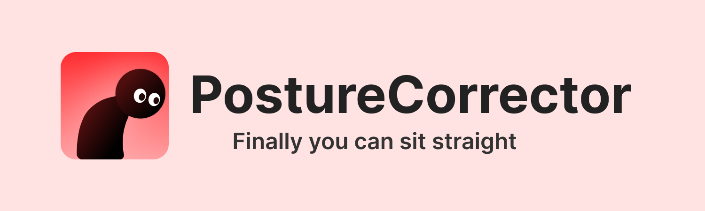
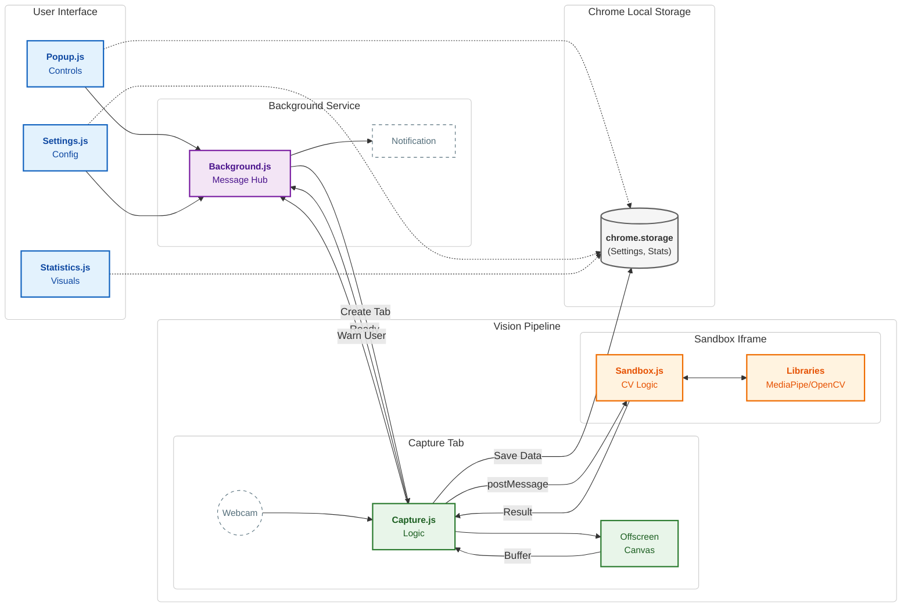

<div align="center">
  

  [](https://chrome.google.com/webstore/detail/glbckpboobaemcfljiijgndjlkcokppi)
  [](https://addons.mozilla.org/firefox/addon/posturecorrector/)
  [](https://chrome.google.com/webstore/detail/glbckpboobaemcfljiijgndjlkcokppi)
  [](https://addons.mozilla.org/firefox/addon/posturecorrector/)
  [](./LICENSE)
</div>

---

## 📋 Table of Contents

1. [Overview](#-overview)
2. [Architecture](#-architecture)
3. [Technical Decisions](#-technical-decisions)
4. [Project Structure](#-project-structure)
5. [Installation & Setup](#-installation--setup)
6. [Build & Release](#-build--release)

---

## 🔭 Overview

PostureCorrector is a lightweight browser extension that uses webcam footage to detect bad posture (i.e., slouching) in real-time and alert users through desktop notifications. It
is also provides comprehensive posture statistics and allows user to customize and configure the extension for their settings and enviroment. 

**Key Features:**
*   **Smart Posture Detection:** PostureCorrector uses sophisticated computer vision algorithms to accurately detect your posture in real-time
*   **Gentle Alerts:** Receive desktop notifications when bad posture is detected
*   **Comprehensive Posture Statistics:** Understand your posture patterns with the detailed statistics and visualizations
*   **Customizable Experience:** Choose your preferred webcam, tailor posture detection frequency, and adjust threshold values to customize and fine-tine the extension for your hardware and environment
*   **Privacy:** Source-code is publicly available, your data never leaves your computer, and no external servers or data transmission

---

## 📂 Project Structure

```text
src/
├── assets/
│   ├── icons/          # PostureCorrector icons (16, 48, 128px)
│   ├── mediapipe/      # MediaPipe WASM binaries and models
│   ├── opencv/         # OpenCV.js library files
│   └── popup_icons/    # Icons for the navigation links in the popup
├── html/
│   ├── capture.html    # Handles getUserMedia & frame extraction
│   ├── popup.html      # Main entry point for user interaction
│   ├── sandbox.html    # ISOLATED: Runs OpenCV/MediaPipe logic
│   ├── settings.html   # User configuration
│   └── statistics.html # Visualization dashboard
├── js/
│   ├── background.js   # Service Worker (orchestrates messaging)
│   ├── capture.js      # Logic for camera access, statistics calculation and storage
│   ├── popup.js        # Popup UI logic
│   ├── sandbox.js      # Logic for computer vision algorithm
│   ├── settings.js     # Saves/Loads config to chrome.storage
│   └── statistics.js   # Renders Chart.js graphs
├── styles/
│   ├── capture-styles.css
│   ├── popup-styles.css
│   ├── settings-styles.css
│   └── statistics-styles.css
└── manifest.json       # Extension Configuration
```

---

## 🧩 Architecture

This project utilizes the **Manifest V3** for the Chrome Web Store version and **Manifest V2** for the Firefox Add-ons version. 
It uses the **Sandboxed Offloading Pattern**. Since Manifest V3 restricts `eval()` and `WASM` compilation in standard extension 
pages, we offload the heavy computer vision processing to a sandboxed iframe (`sandbox.html`).

### Data Flow



---

## 💡 Technical Decisions

A simple, lightweight, and client-side only architecture was prioritized to ensure privacy and performance without needing a backend server.

| Technology/Component | Choice | Motivation |
| :--- | :--- | :--- |
| **Language** | **JavaScript** | Browser extensions rely heavily on passing loose objects (messages) between scripts. TypeScript ensures strict typing for these contracts, preventing runtime errors. |
| **Styling** | **CSS** | Separate CSS files (popup-styles.css, settings-styles.css) keep styles scoped to their specific HTML views, preventing style leakage. |
| **Build Tool** | **Bun** | Bun provides an extremely fast, zero-config way to bundle and minify plain HTML/CSS/JS while keeping the tooling lightweight. |
| **Facial Landmark Detection** | **MediaPipe** | Selected for its lightweight, pre-trained Face Mesh model. It provides robust landmark coordinates directly in the browser more efficiently than training a custom model. |
| **Computer Vision Algorithm** | **OpenCV.js** | Used specifically for post-processing landmarks. Once MediaPipe provides the points, OpenCV efficiently handles the vector mathematics to calculate pitch angle of the  and head-to-webcam distance. |
| **Execution** | **Sandboxed Page** | Required by Manifest V3. This isolates the heavy WASM execution (MediaPipe/OpenCV) from the extension's main process, preventing CSP violations and keeping the UI responsive. |
| **Visualization** | **Chart.js** | A lightweight canvas library chosen to render the real-time posture data streams without the overhead of heavier data science libraries. |

---

## 📄 License

Distributed under the AGPL-3.0 license. See `LICENSE` for more information.
